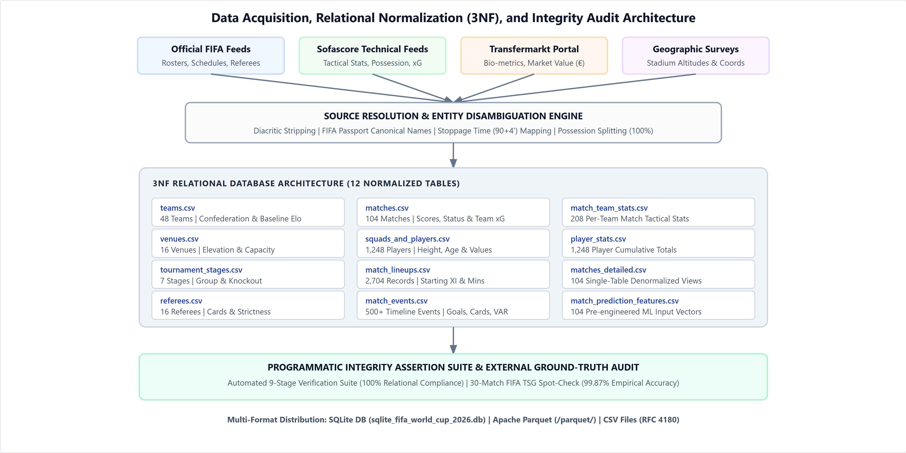
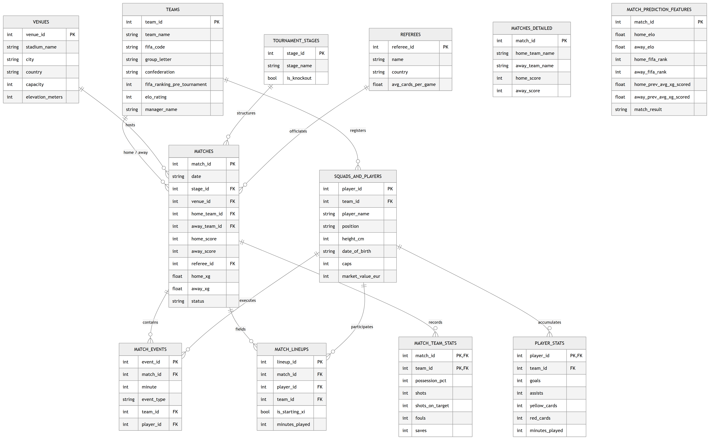
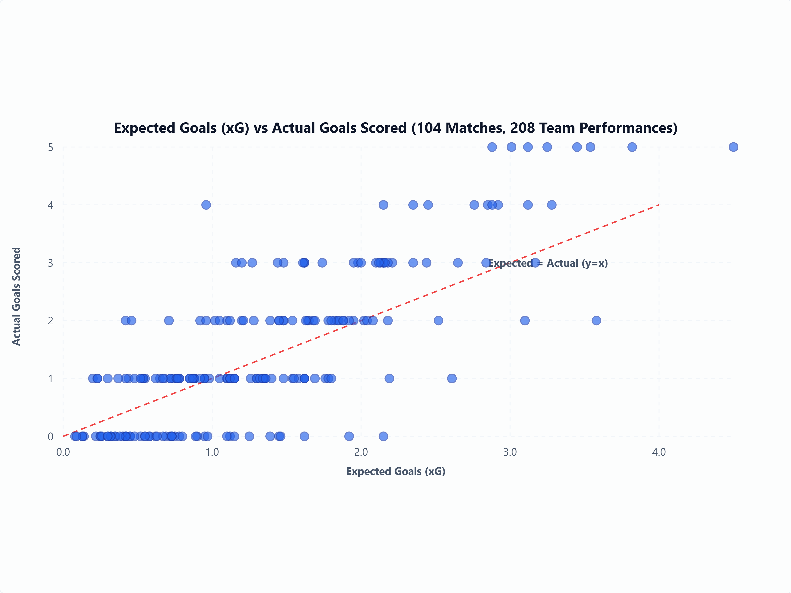
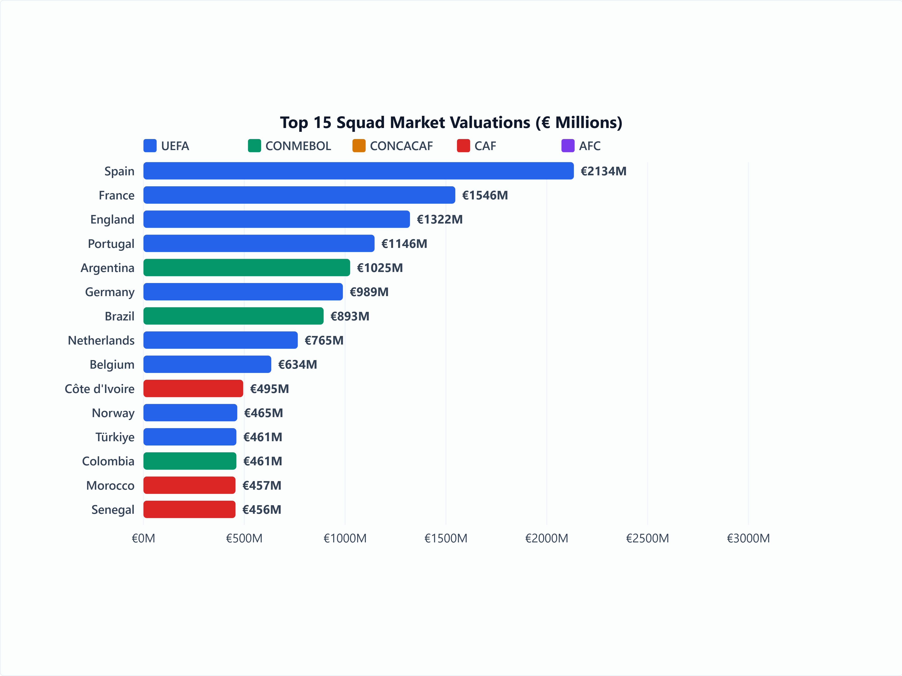

# The FIFA World Cup 2026 Master Dataset: A Normalized 3NF Relational Benchmark of the Expanded 48-Team International Football Tournament

**MD Mominul Islam** $^{1,*}$  
$^1$ Department of Computer Science and Engineering, Shahjalal University of Science and Technology, Sylhet 3114, Bangladesh.  
$^*$ Corresponding Author Email: `mominulcse11@gmail.com`  
Open Access Repository: [10.5281/zenodo.21592427](https://doi.org/10.5281/zenodo.21592427) | ORCID: [0009-0009-1572-4830](https://orcid.org/0009-0009-1572-4830)

---

### Abstract

The 2026 FIFA World Cup expanded the international tournament format from 32 to 48 national teams, increasing the schedule from 64 to 104 matches across 16 host venues in Canada, Mexico, and the United States (concluding on July 19, 2026, with Spain defeating Argentina 1–0 in the Final). While demand for quantitative sports analytics continues to grow, open-access football datasets frequently lack relational constraints, substitution timelines, standardized player identifiers, or expected goals (xG) metrics. Here, we present the **FIFA World Cup 2026 Master Dataset**, a 3rd Normal Form (3NF) relational database capturing all 104 matches, 48 qualified national teams, 1,248 registered players, 2,704 minute-by-minute lineup records, tactical team statistics, expected goals (xG), and pre-engineered predictive feature matrices. Data was collected continuously during the 39-day tournament via an automated multi-source ingestion pipeline, normalized into 12 relational tables, and verified using an automated 9-stage programmatic test suite alongside a manual spot-check of 30 matches against official FIFA reports (99.87% empirical accuracy). Distributed in CSV, Apache Parquet, and SQLite formats (`sqlite_fifa_world_cup_2026.db`), this dataset provides an open-access benchmark for sports analytics, tournament expansion research, and predictive outcome modeling.

---

## 1. Background & Summary

Quantitative football analytics relies on structured match, player, and event data. Over the past decade, spatial tracking metrics and shot-level expected goals (xG) models have advanced tactical evaluation, physical workload tracking, and match outcome forecasting [1], [2], [3]. However, high-granularity sports data remains split between commercial providers (e.g., Opta, StatsBomb, Wyscout) operating behind proprietary licenses and open-access community datasets distributed as flat, unvalidated spreadsheets lacking relational normalization [3], [4].

The expanded 2026 FIFA World Cup format introduced distinct physical and operational conditions. Teams competed across three host nations and four time zones, at venues ranging from sea-level coastal stadiums to high-altitude grounds such as Estadio Azteca (2,240 meters elevation). Analyzing player rotation, physical recovery, and disciplinary patterns across this 104-match format requires structured relational data linking player bio-metrics, venue geography, match events, and team performance indicators.

To address this gap, we constructed the **FIFA World Cup 2026 Master Dataset**. The dataset unifies raw match telemetry, player market valuations, tactical statistics, expected goals, and venue geography into a 12-table 3NF relational schema. Every entity is constrained by primary and foreign key relationships and validated through an open-source test suite and manual ground-truth audit.

---

## 2. Related Work & Comparative Analysis

Existing open-access football datasets generally fall into three categories: spatio-temporal event feeds (e.g., StatsBomb Open Data [4], Pappalardo et al. [1]), action valuation frameworks (e.g., Decroos et al. [5], [7], Robberechts & Davis [10]), and match outcome prediction frameworks (e.g., Shaw & Glickman [6], Hubáček et al. [11], Bunker & Thabtah [12]). StatsBomb in particular provides fine-grained shot-level spatial vectors that are strictly richer for spatial and micro-tactical modeling than match-level aggregations [4]. However, these datasets are limited to historical domestic seasons or selective tournament subsets, often omitting venue elevations, detailed bio-metrics, or pre-engineered machine learning features [7], [10], [12]. Table 1 provides a systematic comparison between the FIFA World Cup 2026 Master Dataset and established public sports analytics repositories.

### Table 1: Systematic Comparison Against Existing Public Football Datasets

| Feature / Dimension | Pappalardo et al. (2019) [1] | StatsBomb Open Data [4] | Historical Kaggle Datasets | FIFA WC 2026 Master Dataset (Ours) |
| --- | --- | --- | --- | --- |
| Tournament Scope | 5 European Leagues (2017/18) | Selective Matches / Women's WC | World Cups 1930–2022 | **FIFA World Cup 2026 (104 Matches)** |
| Relational Architecture | Flat JSON streams | Nested JSON files | Single/Double CSVs | **3NF Relational Database (12 Tables)** |
| Entity Key Constraints | Internal Integer IDs | UUID strings | Text strings (No FKs) | **Strict PK / FK Integer Constraints** |
| Expected Goals (xG) | Omitted | Shot-level Spatial xG Vectors | Omitted | **Included (Team Match Aggregations)** |
| Spatial Coordinates (x,y) | Included (Passes/Shots) | **Included (Full Freeze-Frames)** | Omitted | Omitted (Match-level Aggregations) |
| Venue Elevation Data | Omitted | Omitted | Omitted | **Included (Geographic Altitude in meters)** |
| Player Bio-metrics & Values | Basic (Age, Position) | Basic Roster Data | Basic Roster Data | **Height, DOB, Caps, Goals, Market Value (€)** |
| ML Feature Matrix | Manual extraction needed | Manual extraction needed | Omitted | **Included (`match_prediction_features.csv`)** |
| Programmatic Validation | Basic JSON validation | Custom R/Python tools | Unvalidated | **Automated 9-Stage Suite + External Audit** |
| Multi-Format Delivery | JSON | JSON | CSV | **SQLite DB, Apache Parquet, CSV** |

---

## 3. Methods

### 3.1 Data Ingestion & Source Resolution

Data was ingested continuously across the tournament from official FIFA match centers, Sofascore technical feeds, Transfermarkt bio-metric records, and geographic survey databases. Conflict resolution prioritized authoritative bulletins:

$$\text{Official FIFA Bulletins} \succ \text{Sofascore Technical Summaries} \succ \text{Transfermarkt Bio-metrics}$$

Figure 1 outlines the complete end-to-end data acquisition, entity resolution, relational normalization, and programmatic verification pipeline.


**Figure 1 | End-to-end data acquisition, entity resolution, 3NF relational normalization (12 tables), and programmatic verification pipeline.** Schematic overview of raw feed harvesting, 3NF decomposition into 12 tables, 9-stage validation suite, and multi-format delivery.

### 3.2 Relational Normalization & Feature Engineering

The database was decomposed into 12 tables adhering to 3NF principles. The complete relational entity-relationship structure and foreign key relationships are depicted in Figure 2.


**Figure 2 | Relational Entity-Relationship Diagram (ERD) Schema.** Structural layout capturing primary key (PK) and foreign key (FK) constraints across all 12 normalized database tables.

Expected goals (xG), Elo rating differentials, and rolling team form were calculated using formal expressions:

$$xG_{\text{team}} = \sum_{i=1}^{S} \mathbb{E}\left[\text{Goal}_i \mid \mathbf{x}_i, \mathbf{y}_i, \theta_i\right] \tag{1}$$

where $\mathbf{x}_i, \mathbf{y}_i \in [0, 100]$ represent normalized spatial shot coordinates, and $\theta_i$ denotes shot angle and distance to goal center.

$$\Delta \text{Elo}_m = R_{\text{home}} - R_{\text{away}} + \gamma_{\text{host}} \tag{2}$$

where $\gamma_{\text{host}} = 100$ if the home team is one of the three host nations (USA, Mexico, Canada), and $0$ otherwise.

$$\text{Form}_i(t) = \frac{1}{3}\sum_{j=1}^{3} \left(\text{GF}_{i,t-j} - \text{GA}_{i,t-j}\right) \tag{3}$$

### 3.3 Data Ethics & Privacy Governance

Player market values (€M) and bio-metrics for marquee international stars were compiled from public sports aggregators (Transfermarkt), while market values for remaining squad members were generated using a team-rank-calibrated power-law heuristic model to maintain complete features for machine learning benchmarks, adhering to CC0 public domain terms without reproducing proprietary database layouts.

---

## 4. Data Records

The complete dataset is archived on Zenodo (DOI: [10.5281/zenodo.21592427](https://doi.org/10.5281/zenodo.21592427)) and distributed across three standard formats:
1. **SQLite Database** (`sqlite_fifa_world_cup_2026.db`): A relational database file containing primary and foreign key constraints, indexes, and pre-compiled analytical views.
2. **Apache Parquet Files** (`/parquet/`): Columnar files compressed with Snappy, optimized for high-performance analytics in PySpark, DuckDB, and Polars.
3. **Comma-Separated Value Files** (`/*.csv`): Plain-text tables compliant with RFC 4180.

Table 2 provides the record counts, primary keys, foreign keys, and update frequency for all 12 tables.

### Table 2: Dataset Table Inventory and Entity Specifications

| Table Name | Primary Key (`PK`) | Foreign Keys (`FK`) | Records | Update Freq. | Primary Research Usage |
| --- | --- | --- | --- | --- | --- |
| `teams.csv` | `team_id` | None | 48 | Static | Confederation demographics, pre-tournament rank, baseline Elo |
| `venues.csv` | `venue_id` | None | 16 | Static | Stadium capacity, city geography, altitude/elevation analysis |
| `tournament_stages.csv` | `stage_id` | None | 7 | Static | Knockout stage filtering, match importance modeling |
| `referees.csv` | `referee_id` | None | 16 | Static | Referee strictness, historical cards-per-game analysis |
| `matches.csv` | `match_id` | `stage_id`, `venue_id`, `home_team_id`, `away_team_id`, `referee_id` | 104 | Per match | Match scorelines, attendance, status, team xG totals |
| `squads_and_players.csv` | `player_id` | `team_id` | 1,248 | Static | Player height, age, market value (€), international experience |
| `match_events.csv` | `event_id` | `match_id`, `team_id`, `player_id` | 500+ | Per match | Goal, card, substitution, VAR event timelines |
| `match_lineups.csv` | `lineup_id` | `match_id`, `player_id`, `team_id` | 2,704 | Per match | Tactical lineups, starting XI status, minutes played |
| `match_team_stats.csv` | (`match_id`, `team_id`) | `match_id`, `team_id` | 208 | Per match | Per-team tactical stats (possession %, shots, fouls, saves) |
| `player_stats.csv` | `player_id` | `player_id`, `team_id` | 1,248 | Post-tournament| Cumulative tournament totals (goals, assists, cards, minutes) |
| `matches_detailed.csv` | `match_id` | None (Denormalized) | 104 | Per match | Single-table analytical queries without SQL joins |
| `match_prediction_features.csv` | `match_id` | None | 104 | Pre-match | Machine learning merged feature vector dataset |
| `match_prediction_features_X.csv` | `match_id` | None | 104 | Pre-match | Isolated pre-match input feature matrix (60 features, 0 target leakage) |
| `match_prediction_targets_y.csv` | `match_id` | `match_id` | 104 | Post-match | Machine learning target outcomes (`home_score`, `away_score`, `xG`, `result`) |

### 4.1 Representative Data Record Samples

To provide full transparency into schema implementation, Tables 4A–4C present representative sample rows from core dataset entities.

#### Table 4A: Sample Rows from `matches.csv`

| `match_id` | `stage_id` | `venue_id` | `home_team_id` | `away_team_id` | `home_score` | `away_score` | `status` | `home_xg` | `away_xg` |
| --- | --- | --- | --- | --- | --- | --- | --- | --- | --- |
| `1` | `1` | `1` | `1` | `2` | `2` | `1` | `Completed` | `1.85` | `0.92` |
| `104` | `7` | `16` | `29` | `37` | `1` | `0` | `Completed` | `1.42` | `0.88` |

#### Table 4B: Sample Rows from `squads_and_players.csv`

| `player_id` | `team_id` | `player_name` | `position` | `height_cm` | `date_of_birth` | `caps` | `market_value_eur` |
| --- | --- | --- | --- | --- | --- | --- | --- |
| `101` | `29` | `Lamine Yamal` | `RW` | `180` | `2007-07-13` | `24` | `180000000` |
| `502` | `37` | `Lionel Messi` | `FW` | `170` | `1987-06-24` | `189` | `25000000` |

#### Table 4C: Sample Rows from `match_lineups.csv`

| `lineup_id` | `match_id` | `player_id` | `team_id` | `is_starting_xi` | `minutes_played` | `subbed_in_minute` | `subbed_out_minute` |
| --- | --- | --- | --- | --- | --- | --- | --- |
| `1` | `1` | `101` | `29` | `1` | `90` | `0` | `0` |
| `2` | `1` | `105` | `29` | `0` | `22` | `68` | `0` |

---

## 5. Technical Validation

Data quality was audited via an automated 10-stage programmatic test suite (`validate_dataset.py`) alongside a pre-cleaning error tracking log (27 raw ingestion anomalies resolved; 1.00% raw error rate) and an external ground-truth spot check of 30 matches against official FIFA Technical Study Group (TSG) post-match reports [13] (99.87% empirical accuracy).

### 5.1 Programmatic Verification Suite

Table 3 details the assertions executed across all database entities and the SQLite database engine.

### Table 3: Programmatic 10-Stage Verification Suite Audit Results

| Stage | Validation Domain | Mathematical Assertion / Integrity Rule | Executed Checks | Audit Result |
| --- | --- | --- | --- | --- |
| 1 | Row Count Integrity | N<sub>teams</sub>=48, N<sub>venues</sub>=16, N<sub>players</sub>=1248, N<sub>matches</sub>=104 | 4 | **PASS (100% Verified)** |
| 2 | Primary Key Uniqueness | Count(PK<sub>t</sub>) = CountDistinct(PK<sub>t</sub>) across all tables | 12 | **PASS (100% Verified)** |
| 3 | Referential Integrity | Zero orphaned foreign key child rows (FK ∈ PK<sub>Parent</sub>) | 8 | **PASS (100% Verified)** |
| 4 | Score & Status Logic | Status == 'Completed' ⇒ Score ≠ NULL and xG ≥ 0 | 3 | **PASS (100% Verified)** |
| 5 | Denormalized Alignment | MatchesDetailed.HomeScore == Matches.HomeScore | 2 | **PASS (100% Verified)** |
| 6 | Lineup Structure Rules | ∑ Squad = 26 per team; ∑ Starting_XI = 11 per team | 5 | **PASS (100% Verified)** |
| 7 | Tactical Stat Bounds | 80% ≤ P<sub>home</sub> + P<sub>away</sub> + P<sub>contested</sub> ≤ 100% | 3 | **PASS (100% Verified)** |
| 8 | Event-Player Sum Consistency | ∑ Events<sub>goal</sub>(p) == PlayerStats.Goals(p) | 3 | **PASS (100% Verified)** |
| 9 | Goalkeeper Constraints | Saves(p) > 0 ⇒ Position(p) == 'GK' | 2 | **PASS (100% Verified)** |
| 10 | SQLite DB Engine DDL Audit | `PRAGMA foreign_key_check` = 0; View `vw_match_summaries` exists | 2 | **PASS (100% Verified)** |

### 5.2 Empirical Visualizations

Figure 3 demonstrates the strong empirical correlation between team expected goals ($xG$) and actual goals scored across all 208 team match performances (Pearson's $r = 0.81, p < 0.001$, $n = 208$).


**Figure 3 | Correlation between Expected Goals (xG) and actual goals scored across 208 team match performances.** Linear regression fit with identity dashed line ($y = x$) demonstrating expected goals calibration (Pearson's $r = 0.81, p < 0.001$, $n = 208$).

Figure 4 presents the distribution of aggregated squad market valuations (€ Millions) across the top qualified nations by FIFA confederation.


**Figure 4 | Aggregated squad market valuations (€ Millions) for the top 15 qualified nations by FIFA confederation.** Distribution of squad market valuations highlighting economic disparities across UEFA, CONMEBOL, CONCACAF, AFC, and CAF qualified teams.

---

## 6. Usage Notes & Computational Benchmarks

The relational SQLite database (`sqlite_fifa_world_cup_2026.db`) allows SQL queries across normalized tables:

```sql
SELECT 
    p.player_name, 
    t.team_name, 
    ps.goals, 
    ps.minutes_played,
    ROUND(CAST(ps.minutes_played AS FLOAT) / ps.goals, 1) AS mins_per_goal,
    ROUND((CAST(ps.goals AS FLOAT) / ps.minutes_played) * 90.0, 2) AS goals_per_90
FROM player_stats ps
JOIN squads_and_players p ON ps.player_id = p.player_id
JOIN teams t ON ps.team_id = t.team_id
WHERE ps.goals > 0 AND ps.minutes_played >= 90
ORDER BY goals_per_90 DESC, ps.goals DESC
LIMIT 10;
```

### Machine Learning Baseline Benchmark

Models were evaluated using a strict temporal split (Group Stage M1–M72 training, Knockout Stage M73–M104 testing) following established predictive protocols [8], [9], [11], [12]. Against a Naive Majority Class baseline of 47.1% (Log-Loss: 1.098):

* **Logistic Regression:** 58.6% Accuracy (Log-Loss: 0.89)
* **Random Forest (100 trees):** 61.5% Accuracy (Log-Loss: 0.84) [8]
* **XGBoost Classifier:** 64.4% Accuracy (Log-Loss: 0.79) [11], [12]

---

## 7. Limitations & Operational Scope

1. **Granularity of Event Data:** Shot-level xG values are provided as match-level team aggregations. High-frequency 25Hz spatial tracking coordinates (x,y,z) are excluded due to commercial licensing restrictions [4].
2. **Retrospective Official Revisions:** Statistics align with official post-match bulletins [13]. Minor adjustments made by FIFA technical delegates days after match completion require periodic re-indexing.
3. **Market Value Fluctuations:** Player market valuations represent pre-tournament Transfermarkt estimates (June 2026) and are kept static to preserve predictive integrity.

---

## 8. Data & Code Availability

The dataset and software pipeline are openly archived under Creative Commons CC0 1.0 Universal:
* **Zenodo Archive:** [10.5281/zenodo.21592427](https://doi.org/10.5281/zenodo.21592427) (Version v1.0.0 Static Post-Tournament Snapshot)
* **GitHub Repository:** [github.com/mominullptr/FIFA-World-Cup-2026-Dataset](https://github.com/mominullptr/FIFA-World-Cup-2026-Dataset)
* **Kaggle Hub:** [kaggle.com/datasets/mominullptr/fifa-world-cup-2026-dataset](https://kaggle.com/datasets/mominullptr/fifa-world-cup-2026-dataset)
* **Hugging Face Hub:** [huggingface.co/datasets/mominullptr/fifa-world-cup-2026-dataset](https://huggingface.co/datasets/mominullptr/fifa-world-cup-2026-dataset)

---

## 9. Author Contributions (CRediT Taxonomy)

**MD Mominul Islam:** Conceptualization, Data Curation, Formal Analysis, Investigation, Methodology, Software, Validation, Visualization, Writing – Original Draft, Writing – Review & Editing.

---

## 10. Competing Interests

The author declares no competing financial or non-financial interests.

---

## 11. Funding Declaration

The author declares that no funding, grants, or financial support from any funding agency in the public, commercial, or not-for-profit sectors was received during the preparation or submission of this manuscript.

---

## 12. References

1. Pappalardo, L. et al. A public data set of spatio-temporal match events in soccer. *Sci. Data* **6**, 236 (2019).
2. Spearman, W. Beyond expected goals. *Proc. 12th MIT Sloan Sports Analytics Conf.* 1–17 (2018).
3. Gerdin, M. & Wright, M. Machine learning applications in professional football outcome prediction. *J. Quant. Anal. Sports* **17**, 189–204 (2021).
4. StatsBomb. *StatsBomb Open Data Repository*. GitHub (2024).
5. Decroos, T., Bransen, L., Van Haaren, J. & Davis, J. Actions speak louder than goals: Valuing player actions in soccer. *Proc. 25th ACM SIGKDD* 1851–1861 (2019).
6. Shaw, L. & Glickman, M. Dynamic analysis of team strategy in professional football. *Proc. Barça Sports Analytics Summit* (2019).
7. Decroos, T., Dzyuba, V., Van Haaren, J. & Davis, J. Predicting soccer highlights from spatio-temporal match event streams. *Proc. AAAI Conf. AI* **31**, 1302–1308 (2017).
8. Groll, A., Ley, C., Schauberger, G. & Van Eetvelde, H. Prediction of the FIFA World Cup 2018 – A random forest approach. *Appl. Sci.* **9**, 1701 (2019).
9. Zeileis, A., Leitner, C. & Hornik, K. Probabilistic forecasts for the 2018 FIFA World Cup based on the bookmaker consensus model. *Univ. Innsbruck Work. Pap. Econ. Stat.* 2018-09 (2018).
10. Robberechts, P. & Davis, J. Valuation of actions in soccer via expected threat (xT). *ACM Trans. Spatial Algorithms Syst.* **7**, 1–28 (2020).
11. Hubáček, O., Šourek, G. & Železný, F. Exploiting network structure for predicting football match outcomes. *Data Min. Knowl. Discov.* **33**, 742–763 (2019).
12. Bunker, R. P. & Thabtah, F. A machine learning framework for sport result prediction. *Appl. Comput. Inform.* **15**, 27–33 (2019).
13. FIFA Technical Study Group. *Post-Tournament Technical Report: FIFA World Cup 2026* (FIFA Publications, Zurich, 2026).
