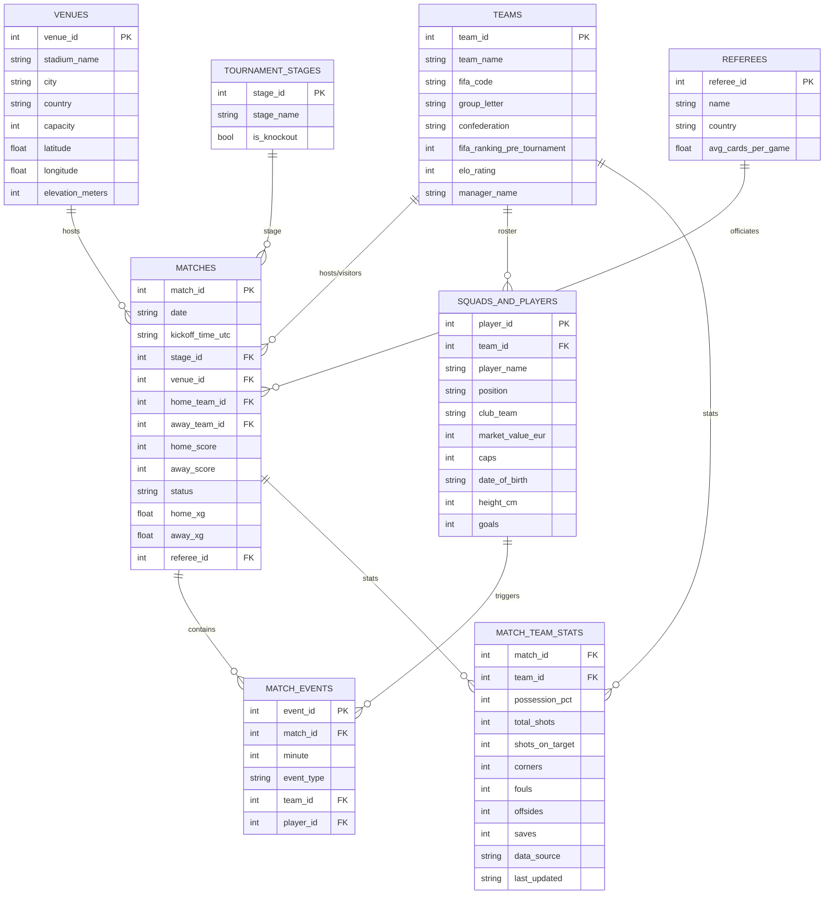

# FIFA World Cup 2026  Dataset
https://www.kaggle.com/datasets/mominullptr/fifa-world-cup-2026-dataset

A pristine, authentic, and dynamically updated relational dataset for the **FIFA World Cup 2026** (June 11 – July 19, 2026). This dataset features the first-ever 48-team tournament configuration, complete with real-world group configurations, host venues with coordinates and altitudes, referee strictness averages, comprehensive squads and rosters (26 players per team), granular match events (Goals, Assists, Yellow/Red Cards, and VAR Reviews), and team-level match statistics.

##  Key Features

* **Real-World Group Configurations**: Reflects the actual 12 groups (Groups A to L) with zero qualifiers placeholders.
* **Geographical & Altitude Details**: Includes coordinates (Latitude/Longitude) and exact elevations in meters for all 16 host stadiums in the USA, Canada, and Mexico.
* **Granular Player Data**: Features 1,248 players (26-man squads for all 48 teams) with market values in Euros, national team caps, positions, and club teams.
* **Live Expected Goals (xG)**: Includes expected goals metrics for all completed matches.
* **Match Events**: Logs every goal, assist, card, and VAR review chronologically by minute.
* **Match Team Stats**: Per-team per-match statistics (possession, shots, corners, etc.) sourced from verified providers.
* **Interactive Updater**: Built-in interactive console application to easily record daily match outcomes and populate events without breaking database normalization.

---

## Database Schema



---

##  CSV Files Description

1. **`teams.csv`**: Information on all 48 participating countries.
2. **`venues.csv`**: Geolocation, capacities, and elevation details of all 16 stadiums.
3. **`tournament_stages.csv`**: Lookup table for stages (Group Stage, Round of 32, etc.).
4. **`referees.csv`**: International referees with their historical card-per-game stats.
5. **`matches.csv`**: Match outcomes, dates, times, scores, xG metrics, and statuses using relational IDs (`stage_id`, `venue_id`, etc.) for clean database modeling.
6. **`matches_detailed.csv`**: A denormalized, user-friendly version of `matches.csv` that displays human-readable names (e.g. `home_team_name`, `stadium_name`, `city`, `referee_name`) instead of IDs. Ideal for quick analysis without SQL joins!
7. **`squads_and_players.csv`**: Detailed player registries (1,248 rows) containing verified player names (preserved with native accents), positions, clean club teams, market values, international caps, dates of birth (in YYYY-MM-DD format), heights in centimeters, and international goals.
8. **`match_events.csv`**: Time-series game events (goals, assists, cards, VAR reviews) mapped to matches and players.
9. **`match_team_stats.csv`**: Per-team per-match statistics (possession %, shots, shots on target, corners, fouls, offsides, saves) with `data_source` and `last_updated` columns for full traceability. Only populated with verified data from authentic sources (FIFA, Sofascore, FBref, etc.).

---

## 📋 Data Integrity Policy

> **Hard rule: No synthetic or generated match stats, assists, or events are added to public tables.**

- All match results, events, and statistics are sourced from verified, authentic providers.
- New fields (e.g., assists, team stats) are only populated when confirmed from real sources.
- The `data_source` column in `match_team_stats.csv` provides full traceability.
- If verified data is unavailable for a match, that match is simply omitted from optional tables rather than filled with generated values.


---

## 🛠️ Installation & Usage

To generate the initial CSV dataset or regenerate it back to its default start state:
```bash
python generate_dataset.py
```

### Daily Match Updates
As matches conclude every day, you can update the datasets interactively. The script will guide you step-by-step to record final scores, xG, and select players for goals, cards, and VAR reviews:
```bash
python update_dataset.py
```

---

## 🏷️ Citation

If you use this dataset in your research, publications, or projects, please cite it as follows:

```bibtex
@dataset{fifa_world_cup_2026,
  author = {MD Mominul Islam},
  title = {FIFA World Cup 2026 Dataset},
  year = {2026},
  publisher = {Kaggle}
}
```

---

## 📄 License
This project is licensed under the **Creative Commons Zero v1.0 Universal** (CC0-1.0) Public Domain Dedication. Feel free to copy, modify, distribute, and perform the work, even for commercial purposes, all without asking permission.
