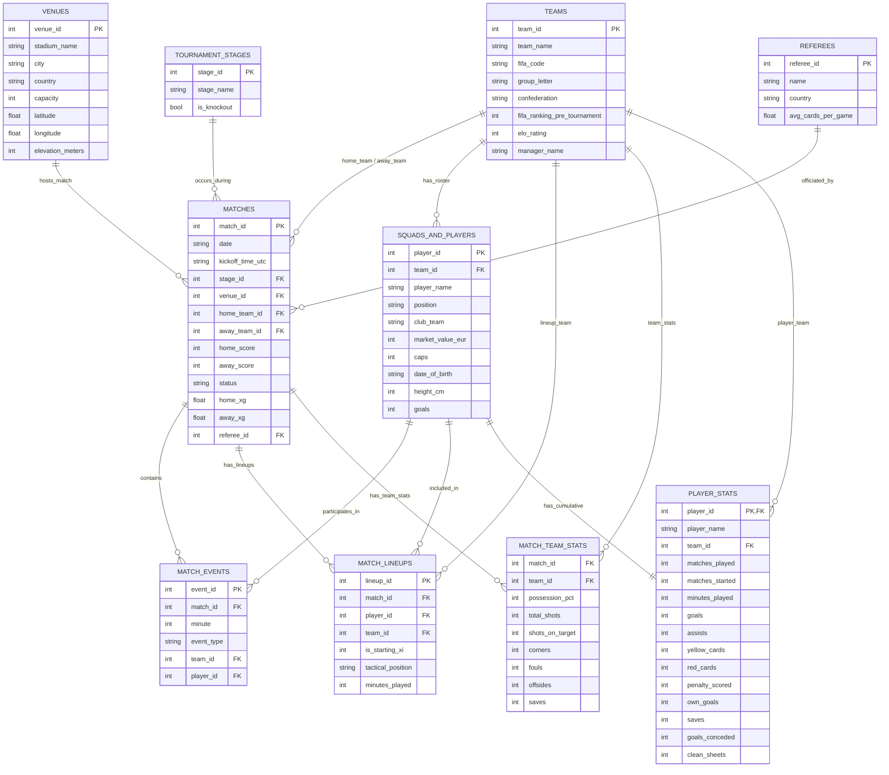

# FIFA World Cup 2026 Dataset — Schema & Table Relationships

This document outlines the relational database schema, primary/foreign keys, and table relationships for the **FIFA World Cup 2026 Dataset**. It is designed to assist data analysts, database administrators, and developers in modeling the dataset in **Power BI**, **SQL Server**, **PostgreSQL**, or other relational database engines.

---

## 📊 Entity-Relationship Diagram (ERD)

Below is the conceptual entity-relationship model of the normalized tables:



---

## 🔑 Primary and Foreign Key Schema Reference

### 1. `teams.csv`
* **Primary Key**: `team_id`
* **Relationships**:
  * One-to-Many with `matches.csv` (on `home_team_id` and `away_team_id`)
  * One-to-Many with `squads_and_players.csv` (on `team_id`)
  * One-to-Many with `match_lineups.csv` (on `team_id`)
  * One-to-Many with `match_team_stats.csv` (on `team_id`)

### 2. `venues.csv`
* **Primary Key**: `venue_id`
* **Relationships**:
  * One-to-Many with `matches.csv` (on `venue_id`)

### 3. `tournament_stages.csv`
* **Primary Key**: `stage_id`
* **Relationships**:
  * One-to-Many with `matches.csv` (on `stage_id`)

### 4. `referees.csv`
* **Primary Key**: `referee_id`
* **Relationships**:
  * One-to-Many with `matches.csv` (on `referee_id`)

### 5. `matches.csv`
* **Primary Key**: `match_id`
* **Foreign Keys**:
  * `stage_id` $\rightarrow$ `tournament_stages.stage_id`
  * `venue_id` $\rightarrow$ `venues.venue_id`
  * `home_team_id` $\rightarrow$ `teams.team_id`
  * `away_team_id` $\rightarrow$ `teams.team_id`
  * `referee_id` $\rightarrow$ `referees.referee_id`
* **Relationships**:
  * One-to-Many with `match_events.csv` (on `match_id`)
  * One-to-Many with `match_lineups.csv` (on `match_id`)
  * One-to-Many with `match_team_stats.csv` (on `match_id`)

### 6. `squads_and_players.csv`
* **Primary Key**: `player_id`
* **Foreign Keys**:
  * `team_id` $\rightarrow$ `teams.team_id`
* **Relationships**:
  * One-to-Many with `match_events.csv` (on `player_id`)
  * One-to-Many with `match_lineups.csv` (on `player_id`)
  * One-to-One with `player_stats.csv` (on `player_id`)

### 7. `match_events.csv`
* **Primary Key**: `event_id`
* **Foreign Keys**:
  * `match_id` $\rightarrow$ `matches.match_id`
  * `team_id` $\rightarrow$ `teams.team_id`
  * `player_id` $\rightarrow$ `squads_and_players.player_id`

### 8. `match_lineups.csv`
* **Primary Key**: `lineup_id`
* **Foreign Keys**:
  * `match_id` $\rightarrow$ `matches.match_id`
  * `player_id` $\rightarrow$ `squads_and_players.player_id`
  * `team_id` $\rightarrow$ `teams.team_id`

### 9. `match_team_stats.csv`
* **Composite Primary Key / Foreign Keys**:
  * `match_id` $\rightarrow$ `matches.match_id`
  * `team_id` $\rightarrow$ `teams.team_id`
* *Note: Each match contains exactly 2 rows in this table (one row for the home team's stats, and one for the away team's stats).*

### 10. `player_stats.csv`
* **Primary / Foreign Key**: `player_id` $\rightarrow$ `squads_and_players.player_id` (One-to-One relationship)
* **Foreign Keys**:
  * `team_id` $\rightarrow$ `teams.team_id`

---

## ⚡ Power BI & SQL Server Modeling Integration Guide

When importing this dataset into **Power BI** or building a relational database schema in **SQL Server**, pay close attention to the following details to avoid relationship ambiguity, circular dependencies, or incorrect cardinality:

### **1. Resolving the `matches` to `match_lineups` Relationship**
* **Relationship**: `matches.match_id` (1) $\rightarrow$ `match_lineups.match_id` (Many)
* **Explanation**: This is a standard and correct **One-to-Many (1:N)** relationship. Each match has exactly **52 lineup rows** (26 players registered per team, for 2 teams). 
* **Power BI Recommendation**: 
  * Connect `matches.match_id` to `match_lineups.match_id` with **1-to-Many** cardinality.
  * Set the **Cross filter direction** to **Single** (where `matches` filters `match_lineups`), not *Both*, to avoid circular path issues.

### **2. Modeling the Role-Playing Dimension on `teams`**
* The `matches` table contains two foreign keys pointing to `teams.team_id`: `home_team_id` and `away_team_id`.
* **SQL Server**: Implement this using two distinct Foreign Key constraints:
  ```sql
  ALTER TABLE matches ADD CONSTRAINT FK_matches_home_team FOREIGN KEY (home_team_id) REFERENCES teams(team_id);
  ALTER TABLE matches ADD CONSTRAINT FK_matches_away_team FOREIGN KEY (away_team_id) REFERENCES teams(team_id);
  ```
* **Power BI**: Power BI does not allow two active relationships between the same two tables.
  * **Option A (Recommended)**: Import the `teams` table twice. Name the first copy **Home Teams** (joined to `home_team_id`) and the second copy **Away Teams** (joined to `away_team_id`). This avoids active/inactive relationship ambiguity.
  * **Option B**: Create one active relationship (e.g. `teams.team_id` to `home_team_id`) and one inactive relationship (to `away_team_id`), then activate the inactive relationship in DAX using `USERELATIONSHIP()`.

### **3. Why `matches_detailed.csv` Has No Relationships**
* **Answer**: `matches_detailed.csv` is a **denormalized** (flat) table. It is deliberately kept independent of the core relational model.
* It includes columns like `home_team_name`, `stadium_name`, `city`, and `referee_name` directly within the row, eliminating the need for database joins.
* **Usage**:
  * If you are building a **fully relational model** (Star/Snowflake Schema) in Power BI or SQL Server, **exclude `matches_detailed.csv`** entirely. Use the normalized `matches.csv`, `teams.csv`, `venues.csv`, etc., instead.
  * If you are creating a quick, simple flat dashboard or running basic pivot tables without joins, use **only `matches_detailed.csv`** as a standalone table.

### **4. Understanding `match_prediction_features.csv`**
* Similar to `matches_detailed.csv`, `match_prediction_features.csv` is a flat, denormalized spreadsheet designed specifically for **Machine Learning modeling** (training classifiers, predicting match outcomes, xG regression, etc.). It should **not** be joined to the core transactional relational model.
